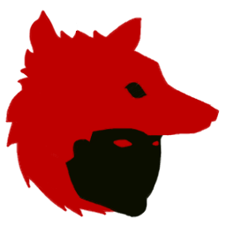
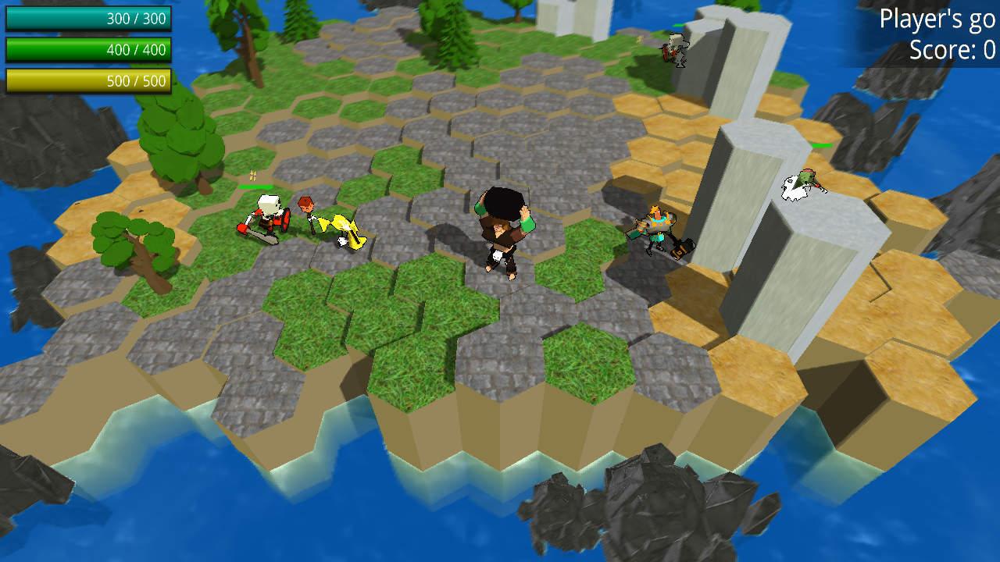

Basic general game engine, based off the wolf engine, written in C++. Designed as a lightweight game engine that acts largely as a framework for 3D game development. This is largely a toy engine and an exercise in developing low level game features, and by extension is not suited for professional game development.

The engine comes with an example game, *Desktop Deities*, that is meant to showcase various features of the engine. This game (as well as the engine itself) was completed as the final project for the videogame specialization at UPEI.

* [Features](docs/features.md)
* [References used](docs/references.md)

To run the example project:
1. Clone or download this repo
2. Open `project\example\example.sln` in visual studio
3. Set the solution configuration to "Debug"
4. Run Local Windows Debugger

Controls:
- WASD - move camera
- Q/E - zoom in/out
- space - toggle special ability of unit
- leftclick - select unit, move to tile
- rightclick - rotate camera
- f - move camera to units on a cycle
- z - save game

To create a new project:
1. Go to `project` folder
2. Run `create-new-project.bat`

Note: you will not be able to create a new project if the `example` project does not exist.
